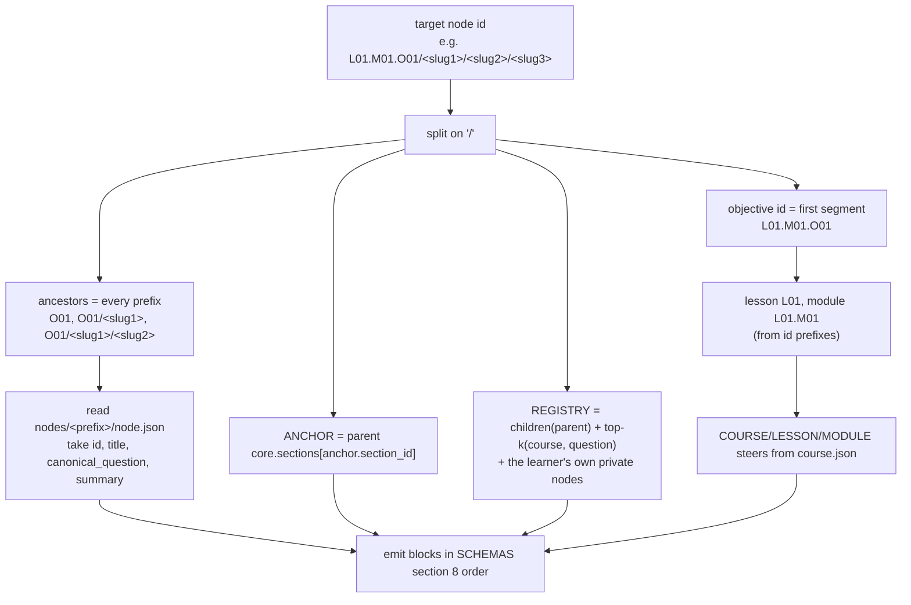

# MP-03 -- Context Compiler (assembly spec + optional compression prompt)

> **Operation:** `COMPILE` (mode `compress`). Assembly itself is deterministic and needs no model.
> **Replaces in EdDAX:** the cascade string built in each handler (`"The course context is: " + course.GPTInstructions + " narrow the response to the lesson context : " + ... + " and the learning objective is: " + qna.Title`) and `SystemMessageContextOptimizer`. That optimizer ran an extra model call before every generation: *"Optimize the system prompt in a way that you will understand it if I were to give you a system message..."*
> **Why change it:**
> - The optimizer doubled the cost and latency of every generation.
> - It could silently drop constraints, and nothing checked what it dropped.
> - It never carried ancestors, so the tree had no memory.
>
> The stack is now assembled by rule (SCHEMAS section 8). A model compresses it only when a small context window forces it, and then under a preservation contract.

---

## A. Deterministic assembly (runtime or human checklist)



Rules:
1. **Order is fixed:** CONFIG, COURSE, LESSON, MODULE, OBJECTIVE, CONCEPTS, LEARNER, PATH, ANCHOR, REGISTRY, SOURCE, CONTENT, PROGRESS, SESSION, INPUT (the same order as SCHEMAS section 8 and the kernel's block list). Stable order improves small-model reliability and prompt caching.
2. **PATH carries summaries, not full content.** Each entry is roughly 40-70 tokens, and its `summary` is the node's summary bullets joined with `" "`. The full text of the **anchored parent section** goes in ANCHOR, because that is what the learner was reading. A client with no directory walk **MAY** rebuild the PATH block from the target node's own `path[]` array (SCHEMAS, Node): each entry is `{id, title, summary}` for one ancestor, root to parent, in order, and a `trail` entry is copied as is. This makes a node self-describing.
3. **Bounded learner text.** The runtime **MUST** truncate INPUT to 500 characters and ANCHOR.quote to 200 characters before assembly, so the verbatim copies MP-05 makes (`question`, `anchor.quote`) are always valid.
4. **REGISTRY (built from per-module files).** The registry is split per module: `registry/<module-id>.json` holds one module's nodes, and `registry/index.json` lists the module files. A node belongs to the registry file of the module its id starts with, so two learners committing follow-ups in different modules never touch the same file and git merges cleanly. A client builds the REGISTRY block by reading the parent's module registry file fully (the parent's children live there), then `registry/index.json`, then up to 12 candidates from other modules chosen by lexical overlap with INPUT; optionally it adds the requesting learner's own private nodes. Each entry carries the fields in SCHEMAS, Registry (including `depth` and `superseded_by`). MP-05 and MP-09 receive REGISTRY exactly as before (children of parent plus course-wide candidates); assembling it from the per-module files is the client's job.
5. **Budget ladder (small models).** If the assembled prompt exceeds `budget_tokens`, apply these steps in order and stop as soon as it fits:
   1. Trim SESSION to the last 4 turns, but keep the list of questions already asked (MP-06 never repeats one).
   2. Trim REGISTRY to the parent's children plus the top 6 candidates.
   3. Collapse CONCEPTS to those referenced by OBJECTIVE and PATH.
   4. Compress PATH: keep the objective entry and the last 3 ancestors verbatim, and replace the middle with one `trail` entry produced by `compress`. A `trail` entry is a summary, not a node: engines never output `"trail"` as an id, and never compute depth by counting PATH entries.
   5. Compress the steers with `compress`.
6. **Never trimmed:** the kernel, the operation prompt, OBJECTIVE, the LEARNER supports and age band, ANCHOR.quote, INPUT, and every id that the output may need to reference.
7. **Manual users (ChatGPT, Claude.ai, phone):** paste MP-00, then the operation prompt, then fill the blocks. For follow-ups, PATH can simply be the list of titles you clicked through, plus one-line summaries.
8. **CONFIG pass-through.** `CONFIG.client` and `CONFIG.write_mode` (SCHEMAS, CONFIG) are copied into the assembled CONFIG block untouched. Assembly never branches on them: only MP-10 mentions `client`, and `write_mode` governs how a client persists an operation's output (S-9 COMMIT PACKET), not how the stack is assembled.

## B. Compression prompt (only when the budget ladder reaches step 4 or 5)

```text
OPERATION: COMPILE (compress)

You compress context for another MetaDAX engine that has a small context window. You are not answering the learner.

INPUT holds blocks to compress, and CONFIG.budget_tokens gives the target size.

Preserve exactly:
- every id outside a PATH `trail` (a `trail` keeps only its endpoints and a count; see below)
- every item in include and exclude lists
- every audience or accessibility constraint
- source_policy and scope_policy
- the objective statement
- any safety-relevant instruction

You may shorten:
- explanations
- rationale
- repeated wording
- examples

For a PATH middle segment, produce one bounded entry:
{"id":"trail","summary":"one or two sentences tracing the line of questions from the first to the last covered node","covers_count":<how many ancestors this replaces>,"first_covered":"<id of the first covered ancestor>","last_covered":"<id of the last covered ancestor>"}.
The trail entry is a summary, not a node, and it is bounded: it does NOT list every covered id. Keep only `first_covered`, `last_covered` and `covers_count`. The full ancestor chain is always recoverable from the registry `parent_id` chain, so the trail never grows with depth.

Output {"type":"compiled","blocks":{"<BLOCK>":"<compressed text or JSON>"},"dropped":[ what you removed, in a few words each ],"warnings":[]}.

If the budget cannot be met without dropping a protected item, say so in warnings ("budget_unmet") and keep the item.
```

## Normative contract

1. Assembly **MUST** be deterministic and **MUST NOT** call a model unless the budget ladder reaches step 4.
2. `compress` output **MUST** list `dropped`. A runtime **SHOULD** log it next to the generation, so a bad answer can be traced to lost context. EdDAX had no such trace.
3. A runtime **MUST** verify that every id outside a PATH `trail` (include/exclude lists, REGISTRY, links) survives compression, and fall back to the uncompressed block if one does not. A PATH `trail` is the one allowed exception: it replaces its middle ancestors with `covers_count` + `first_covered` + `last_covered`, because the full chain is rebuildable from the registry `parent_id` chain.
